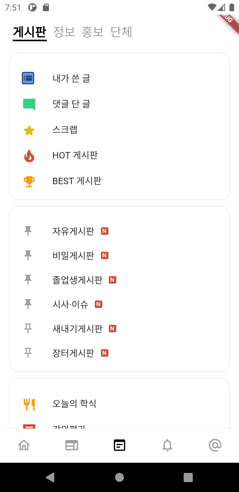

# [에브리타임] 3 Day

# 3 Day



<a aria-current="page" class="active" href="https://github.com/jyukki97/Flutter-Every-Time-Clone" style="color: rgb(18, 184, 134); font-weight: bold;">[에브리타임] 깃 허브 주소</a>

<a aria-current="page" class="active" href="https://jyukki97.github.io/start/" style="color: rgb(18, 184, 134); font-weight: bold;">[에브리타임] 시작</a>

<a aria-current="page" class="active" href="https://jyukki97.github.io/1day/" style="color: rgb(18, 184, 134); font-weight: bold;">[에브리타임] 1 Day</a>

<a aria-current="page" class="active" href="https://jyukki97.github.io/2day/" style="color: rgb(18, 184, 134); font-weight: bold;">[에브리타임] 2 Day</a>

<a aria-current="page" class="active" href="https://jyukki97.github.io/3day/" style="color: rgb(18, 184, 134); font-weight: bold;">[에브리타임] 3 Day</a>

<a aria-current="page" class="active" href="https://jyukki97.github.io/4day/" style="color: rgb(18, 184, 134); font-weight: bold;">[에브리타임] 4 Day</a>



## 한 것

### 게시판 모음 페이지

- ✅ **Icon과 글 있는 Widget 추가**
- ✅ **핀과 글 있는 Widget 추가**

### 모델

- ✅ **Board 모델 추가**
  - **게시판 제목, 즐겨찾기 추가 여부, new 게시물이 있는지 여부, Icon 등이 들어있는 모델을 추가.**
- ✅ **Sample 모델 제작**  

___

## 주절주절..

**그 많은 것을 하나하나 Widget으로 만들려니 귀찮아서 모델을 만듦. 만들어진 모델을 List형식으로 뿌리는 방식으로 해놓으니 한결 편해짐**

**저번에 홈 페이지에서 스크롤 시 Appbar에 그림자가 생기는 것을 그대로 가져왔더니**

**Tabbar가 움직일 때, 옆 Tab은 움직이지 않아도 그림자가 그대로 가는 것을 확인하고, 각 Tab마다 그림자가 생기도록 바꿔봤음.**

**각 Tab에 Scaffold를 두고, Appbar의 크기를 최소로 한 뒤 그림자를 생기게 했는데, 아마 더 좋은 방식이 있을 것같은데 아직은 떠오르지 않음. 나중에 생각나면 바꿔야겠다.**

